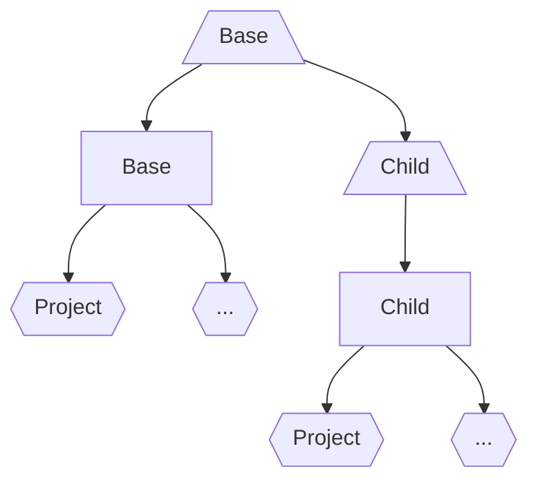

# Template hierarchies

Copier eases the creation and lifecycle management of code projects by
[generating](generating.md) new projects and [updating](updating.md) existing ones as
their associated templates evolve. But when creating collections of templates, template
hierarchies often emerge wherein several templates share a common foundation (e.g. setup
and configuration of common developer tools, packaging configuration, etc.). Naively,
the commonalities would be duplicated in all templates which makes maintenance an
intricate and manual effort that does not scale.

**Enter _meta-templates_**.

A meta-template is a regular template (with a particular project layout and
configuration) whose generated output is a template itself. With meta-templates,
Copier's lifecycle management can be utilized for applying the changes in a parent
template to a child template similar to how a generated project is updated as its
template evolves. While the idea of a template hierarchy is often associated with the
term _template inheritance_, Copier's meta-templates recipe does not actually use any
kind of inheritance mechanism (such as [Jinja's template
inheritance][jinja-inheritance]) but rather a chain of updates down the hierarchy, which
provides significant flexibility for customization to child template creators without
the need for a parent template creator to anticipate useful extension points (e.g. via
[Jinja blocks](jinja-blocks)).

## Concept

Meta-templates introduce a layer of indirection which enables applying changes in a
parent template to a child template. The following diagram depicts the relationship
between meta-templates (trapezoid shape), templates (rectangle shape), and projects
(hexagon shape):



A meta-template is used to generate a template which in turn is used to generate
projects. This means, any changes to a template are made _only_ in the corresponding
meta-template and _never_ directly in the template itself. Instead, the template is
_always_ [regenerated](generating.md#regenerating-a-project) from the meta-template via
`copier copy`.

To extend a parent template, a
[child meta-template is created](#creating-a-child-meta-template), populated with the
generated template from the parent meta-template, and edited as needed. In other words,
a child template and its parent template are indirectly related via their corresponding
meta-templates.

!!! hint

    In advanced scenarios, it may even be useful to parametrize the meta-template
    through [questions](configuring.md#questions).

## Project layout

A meta-template has several conventional requirements:

1.  The meta-template's content root must be a
    [subdirectory](configuring.md#subdirectory).
1.  The Jinja [templates suffix](configuring.md#templates_suffix) and
    [environment](configuring.md#envops) ([block, variable, and comment
    markers][jinja-environment]) must be different for the meta-template and the
    generated template to not collide when generating the template from the
    meta-template.
1.  The location of the [answers file](configuring.md#the-copier-answersyml-file) in a
    child meta-template associated with the parent meta-template should be in the root
    directory of the child meta-template to not collide with the rendered answers file
    of the template generated from the child meta-template.

The project layout of a basic meta-template may look like this:

```shell title="Meta-template project layout"
📁 my_copier_meta_template
├── 📄 .copier-answers.yml                            # (1)
├── 📄 copier.yml                                     # (2)
└── 📁 meta-template                                  # (3)
    ├── 📄 [[ _copier_conf.answers_file ]].j2         # (4)
    ├── 📄 copier.yml                                 # (5)
    └── 📁 template                                   # (6)
        ├── 📄 {{ _copier_conf.answers_file }}.jinja  # (7)
        └── ...
```

1.  The answers file associated with the parent meta-template. This file is generated by
    Copier and only exists if the meta-template extends another meta-template. See the
    section on [creating a child meta-template](#creating-a-child-meta-template) for
    more details.
1.  The `copier.yml` file of the meta-template containing mainly Jinja-related settings.
1.  The subdirectory containing the meta-template content.
1.  The answers file (Jinja template) that will be rendered in the generated template.
1.  The `copier.yml` file in the generated template.
1.  The subdirectory containing the content of the generated template.
1.  The answers file that will be rendered in the generated project based on the
    generated template.

The content of the meta-template's `copier.yml` file may look like this:

```yaml title="copier.yml"
_subdirectory: meta-template
_templates_suffix: .j2
_envops:
    block_start_string: "[%"
    block_end_string: "%]"
    comment_start_string: "[#"
    comment_end_string: "#]"
    variable_start_string: "[["
    variable_end_string: "]]"
```

## Creating a child meta-template

Creating a child meta-template that extends a parent meta-template involves generating
the output of the parent meta-template into the `meta-template` directory of the child
meta-template. These are the steps:

1.  Create a child meta-template skeleton with the following project layout:

    ```shell title="Child meta-template skeleton"
    📁 my_copier_child_meta_template
    ├── 📄 copier.yml
    └── 📁 meta-template
        └── 📄 [[ _copier_conf.answers_file ]].j2
    ```

1.  Generate the template from a parent meta-template into the `meta-template` directory
    and write the answers file to the root of the child meta-template:

    ```shell
    copier --answers-file ../.copier-answers.yml \
        my_copier_parent_meta_template \
        my_copier_child_meta_template/meta-template
    ```

    As a result, the following additions are made:

    ```diff title="Child meta-template project layout"
     📁 my_copier_child_meta_template
    +├── 📄 .copier-answers.yml
     ├── 📄 copier.yml
     └── 📁 meta-template
         ├── 📄 [[ _copier_conf.answers_file ]].j2
    +    ├── 📄 copier.yml
    +    └── 📁 template
    +        ├── 📄 {{ _copier_conf.answers_file }}.jinja
    +        └── ...
    ```

1.  Edit the child meta-template as needed.

## Updating a child meta-template

To apply the changes in a parent meta-template to a child meta-template, run:

```shell
copier update --answers-file ../.copier-answers.yml my_copier_child_meta_template/meta-template
```

[jinja-blocks]: https://jinja.palletsprojects.com/en/3.1.x/templates/#blocks
[jinja-environment]: https://jinja.palletsprojects.com/en/3.1.x/api/#jinja2.Environment
[jinja-inheritance]:
    https://jinja.palletsprojects.com/en/3.1.x/templates/#template-inheritance
