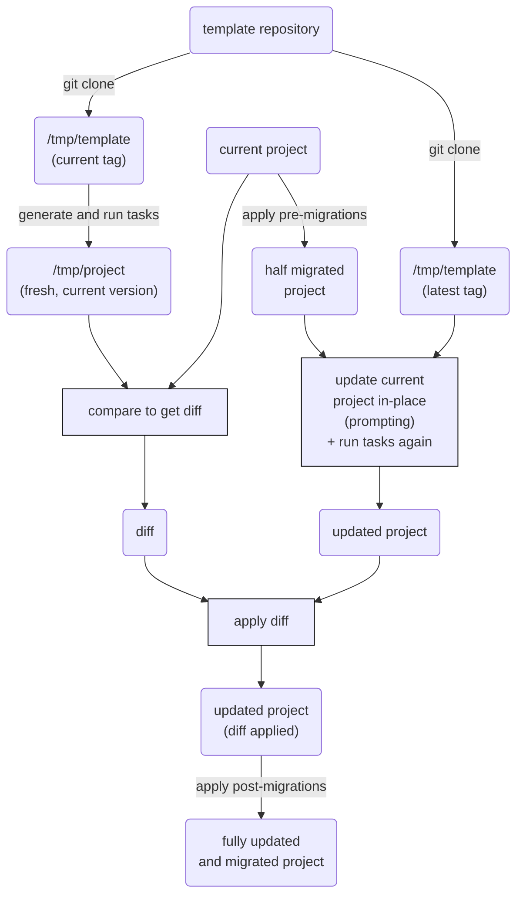

# Updating a project

The best way to update a project from its template is when all of these conditions are
true:

1. The template includes
   [a valid `.copier-answers.yml` file](configuring.md#the-copier-answersyml-file).
2. The template is versioned with git (with tags).
3. The destination folder is versioned with git.

If that's your case, then just enter the destination folder, make sure `git status`
shows it clean, and run:

```bash
copier update
```

This will read all available git tags, will compare them using
[PEP 440](https://www.python.org/dev/peps/pep-0440/), and will check out the latest one
before updating. To update to the latest commit, add `--vcs-ref=HEAD`. You can use any
other git ref you want.

When updating, Copier will do its best to respect your project evolution by using the
answers you provided when copied last time. However, sometimes it's impossible for
Copier to know what to do with a diff code hunk. In those cases, you will find `*.rej`
files that contain the unresolved diffs. _You should review those manually_ before
committing.

You probably don't want `*.rej` files in your git history, but if you add them to
`.gitignore`, some important changes could pass unnoticed to you. That's why the
recommended way to deal with them is to _not_ add them to add a
[pre-commit](https://pre-commit.com/) (or equivalent) hook that forbids them, just like
this:

```yaml title=".pre-commit-config.yaml"
repos:
    - repo: local
      hooks:
          - id: forbidden-files
            name: forbidden files
            entry: found copier update rejection files; review them and remove them
            language: fail
            files: "\\.rej$"
```

## Never change the answers file manually

!!! important

    **Never** update `.copier-answers.yml` manually.

    This will trick Copier, making it believe that those modified answers produced the
    current subproject, while it was produced by a different answers set. This will
    produce unpredictable behavior of the smart diff algorithm used for updates, which
    may work under certain circumstances, but not always.

    **This is an unsupported way to update**. Please do not open issues if you updated
    this way.

**The correct process to update a subproject** is:

1. Run `copier update`.
1. Answer to the questions. They'll default to your answers on your last update.

If you want to just reuse all previous answers:

```sh
copier --force update
```

If you want to change just one question, and leave all others untouched, and don't want
to go through the whole questionary again:

```sh
copier --force --data updated_question="my new answer" update
```

## How the update works

To understand how the updating process works, take a look at this diagram:



As you can see here, `copier` does several things:

-   it regenerates a fresh project from the current template version
-   then it compares both version, to get the diff from "fresh project" to "current
    project"
-   now it applies pre-migrations to your project, and updates the current project with
    the latest template changes (asking confirmation)
-   finally, it re-applies the previously obtained diff, and then run the
    post-migrations

!!! important

    The diff obtained by comparing the fresh, regenerated project to your
    current project can cancel the modifications applied by the update from the latest
    template version. During the process, `copier` will ask you confirmation to overwrite or
    skip modifications, but in the end, it is possible that nothing has changed (except for
    the version in `.copier-answers.yml` of course). This is not a bug: although it can be
    quite surprising, this behavior is correct.

## Migration across Copier major versions

When there's a new major release of Copier (for example from Copier 5.x to 6.x), there
are chances that there's something that changed. Maybe your template will not work as it
did before.

[As explained above][how-the-update-works], Copier needs to make a copy of the template
in its old state with its old answers so it can actually produce a diff with the new
state and answers and apply the smart update to the project. However, **how can I be
sure that Copier will produce the same "old state" if I copied the template with an
older Copier major release?**. Good question.

We will do our best to respect older behaviors for at least one extra major release
cycle, but the simpler answer is that you can't be sure of that.

How to overcome that situation?

1. You can write good [migrations][].
1. Then you can test them on your template's CI on a matrix against several Copier
   versions.
1. Or you can just [recopy the project][regenerating-a-project] when you update to a
   newer Copier major release.
