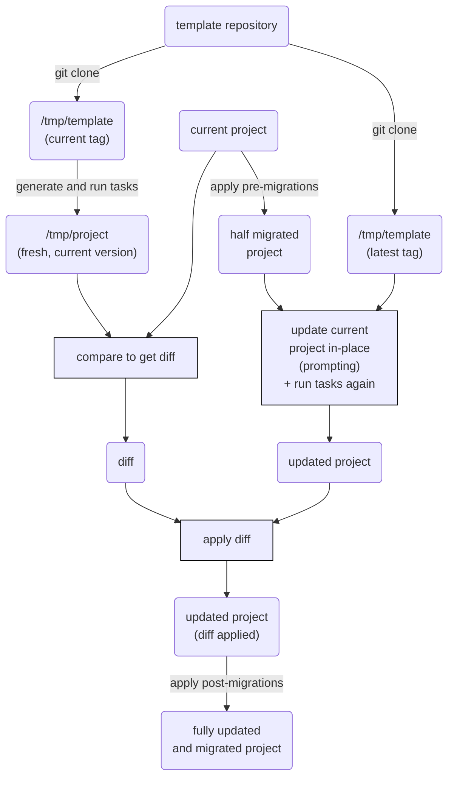

# Updating a project

Copier enables the code lifecycle management for generated projects. There are several
common use cases for that, including but not limited to

1. Update the answers to previous questions

    Questions can be reanswered to fit the latest requirements of the generated
    projects. This is helpful, especially when the template includes optional tools that
    fit into different phases of a project. In that case, template consumers are able to
    activate the optional tools gradually when the project matures.

1. Sync updates from evolved templates

    The template creators might update the template to add new functionalities or bug
    fixes. The generated project can get updated if the template consumers want to keep
    it to the latest version.

The best way to update a project from its template is when all of these conditions are
true:

1. The destination folder includes [a valid `.copier-answers.yml`
   file][the-copier-answersyml-file].
1. The template is versioned with Git (with tags).
1. The destination folder is versioned with Git.

If that's your case, then just enter the destination folder, make sure `git status`
shows it clean, and run:

```shell
copier update
```

This will read all available Git tags, will compare them using
[PEP 440](https://www.python.org/dev/peps/pep-0440/), and will check out the latest one
before updating. To update to the latest commit, add `--vcs-ref=HEAD`. You can use any
other Git ref you want.

When updating, Copier will do its best to respect your project evolution by using the
answers you provided when copied last time. However, sometimes it's impossible for
Copier to know what to do with a diff code hunk. In those cases, copier handles the
conflict in one of two ways, controlled with the `--conflict` option:

-   `--conflict rej`: Creates a separate `.rej` file for each file with conflicts. These
    files contain the unresolved diffs.
-   `--conflict inline` (default): Updates the file with conflict markers. This is quite
    similar to the conflict markers created when a `git merge` command encounters a
    conflict. For more information, see the "Checking Out Conflicts" section of the
    [`git` documentation](https://git-scm.com/book/en/v2/Git-Tools-Advanced-Merging).

If the update results in conflicts, _you should review those manually_ before
committing.

You probably don't want to lose important changes or to include merge conflicts in your
Git history, but if you aren't careful, it's easy to make mistakes.

That's why the recommended way to prevent these mistakes is to add a
[pre-commit](https://pre-commit.com/) (or equivalent) hook that forbids committing
conflict files or markers. The recommended hook configuration depends on the `conflict`
setting you use.

## Preventing Commit of Merge Conflicts

If you use `--conflict inline` (the default) then you need to check for conflicts
markers in your files:

```yaml title=".pre-commit-config.yaml"
repos:
    - repo: https://github.com/pre-commit/pre-commit-hooks
      rev: v4.3.0
      hooks:
          # Prevent committing inline conflict markers
          - id: check-merge-conflict
            args: [--assume-in-merge]
```

If you use `--conflict rej` then you need to review and remove all generated `.rej`
files:

```yaml title=".pre-commit-config.yaml"
repos:
    - repo: local
      hooks:
          # Prevent committing .rej files
          - id: forbidden-files
            name: forbidden files
            entry:
                found Copier update rejection files; review and remove them before
                merging.
            language: fail
            files: "\\.rej$"
```

!!! note

    For projects that use both `rej` and `inline` depending on each user's preference,
    you can add both hooks to your `pre-commit-config.yaml` file, making sure that no
    unresolved merge conflicts are committed.

## Never change the answers file manually

!!! important

    **Never** update `.copier-answers.yml` manually.

    This will trick Copier, making it believe that those modified answers produced the
    current subproject, while it was produced by a different answers set. This will
    produce unpredictable behavior of the smart diff algorithm used for updates, which
    may work under certain circumstances, but not always.

    **This is an unsupported way to update**. Please do not open issues if you updated
    this way.

**The correct process to update a subproject** is:

1. Run `copier update`.
1. Answer the questions. They'll default to your answers on your last update.

If you want to just reuse all previous answers:

```shell
copier update --defaults
```

If you want to change just one question, and leave all others untouched, and don't want
to go through the whole questionnaire again:

```shell
copier update --defaults --data updated_question="my new answer"
```

You can achieve the same using a [data file][data_file]:

```shell
echo "updated_question: my new answer" > /tmp/data-file.yaml
copier update --defaults --data-file /tmp/data-file.yaml
```

!!! note

    Due to [issue #1474](https://github.com/copier-org/copier/issues/1474),
    it is not yet possible to update a multiselect choice using ˋ--dataˋ.
    Use ˋ--data-fileˋ instead for now.

If you want to update the answers to all questions, but not the template:

```shell
copier update --vcs-ref=:current:
```

## How the update works

To understand how the updating process works, take a look at this diagram:



As you can see here, `copier` does several things:

-   It regenerates a fresh project from the current template version.
-   Then, it compares both version to get the diff from "fresh project" to "current
    project".
-   Now, it applies pre-migrations to your project, and updates the current project with
    the latest template changes (asking for confirmation).
-   Finally, it re-applies the previously obtained diff and then runs the
    post-migrations.

### Handling of deleted paths

Template-based files/directories that were deleted in the generated project are
automatically excluded from updates. If you want to recover such a file later on, you
can run `copier recopy` and recommit it to your repository. Subsequent updates for the
path will then be respected again.

An exception to this behavior applies to paths that are matched by `skip_if_exists`.
Their presence is always ensured, even during an `update` operation.

### Recover from a broken update

Usually Copier will replay the last project generation without problems. However,
sometimes that process can break. Examples:

-   When the last update was relying on some external resources that are no longer
    available.
-   When the old and new versions of the template depend on different incompatible
    versions of the same Jinja extension, but Copier can only use one.
-   When the old version of the template was built for an older version of Copier.

Generally, you should keep your templates as pure and simple as possible to avoid those
situations. But it can still happen.

To overcome this, use [the `copier recopy` command][regenerating-a-project], which will
discard all the smart update algorithm [explained above][how-the-update-works]. It will
behave just like if you were applying the template for the first time, but it will keep
your answers from the last update.

Of course, the experience will be less satisfactory. The new template will override any
changes found in your local project. But you can use a Git diff tool to overcome that.
After doing this, further updates generally keep on working as usual.

### Aborting an update

When you're not happy with the result of a `copier update` run or unsure about adding
the introduced changes to your code base, specifically when you have unpleasant
conflicts, it's not 100% obvious how to get back to the previously clean copy of your
branch. The following strategies won't work:

-   `git checkout <branch>` – _error: you need to resolve your current index first_
-   `git checkout .` – _error: path '&lt;filename&gt;' is unmerged_
-   `git merge --abort` – _fatal: There is no merge to abort (MERGE_HEAD missing)_

Here is what you can do using Git in the terminal to throw away all changes:

```shell
git reset           # throw away merge conflict information
git checkout .      # restore modified files
git clean -d -i     # remove untracked files and folders
```

If you want fine-grained control to restore files selectively, read the output of the
`git status` command attentively. It shows all the commands you may need as hints!
